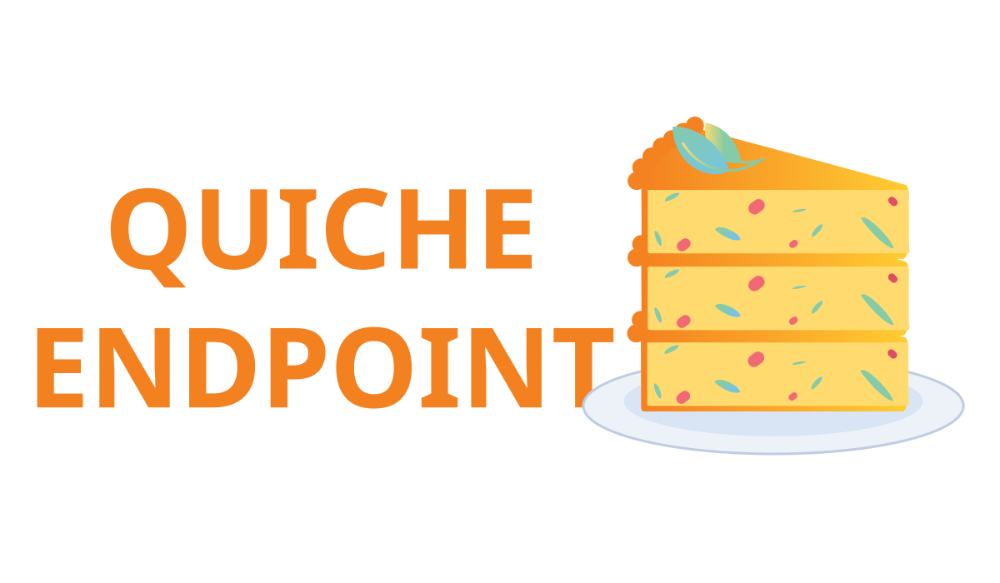

<div align="center">
    
</div>

# Quiche Endpoint

> ⚠️ Not production ready

> This project is not affiliated with [Cloudflare quiche](https://github.com/cloudflare/quiche)

**Quiche Endpoint** provides a low-level endpoint implementation for the [quiche](https://github.com/cloudflare/quiche) QUIC library.  
It handles multiple QUIC connections over a single UDP socket, making application development easy while maintaining full control over networking behavior.

The **endpoint** is a state machine, similar to [quiche](https://github.com/cloudflare/quiche).
Socket I/O and timers are managed by the application.

## Features
- QUIC connection multiplexing
- UDP multiplexing
- Batched send and receive
- Version negotiation
- Retry support

## Build
```shell
cargo build
```
